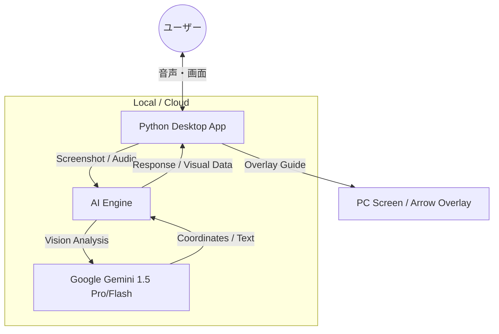

# SENP_AI - Gemini-Powered PC Assistant 🤖👀

[](https://opensource.org/licenses/MIT)
[](https://www.python.org/downloads/)
[](https://aistudio.google.com/)

**SENP_AI** は、Google Gemini のマルチモーダル機能を活用した、PC操作を視覚的・直感的にサポートするAIアシスタントです。AIがあなたの「目」となり、画面上の情報を読み取って操作をガイドします。

---

## 🌟 主な機能

- **マルチモーダル画面解析**: 現在のスクリーンショットをAIが解析し、内容に基づいた回答を提供。
- **音声インタフェース**:
  - **音声認識 (STT)**: マイクボタンから話しかけるだけで質問が可能。
  - **音声合成 (TTS)**: AIの回答を自然な音声で読み上げ。
- **直感的なナビゲーション (Visual Guide)**: 操作箇所を画面上に赤い矢印で直接指示。
- **スクロールキャプチャ対応**: 画面外の長いページもAIが一度に把握し、全体を考慮した回答を実現。
- **フレキシブルな実行モード**:
  - **Local Mode**: 自身のAPIキーを使用してローカルで推論を実行。
  - **Cloud Mode**: Google Cloud Run 上のバックエンドと連携し、より高速かつスケーラブルに動作。

## 🏗️ システムアーキテクチャ



## 🚀 セットアップ

### 1. 依存パッケージのインストール

Python 3.9以上がインストールされていることを確認してください。

```bash
pip install -r requirements.txt
```

### 2. 環境変数の設定

`Local Mode` で動かす場合はAPIキーが必要です。`Cloud Mode` の場合はバックエンドURLを指定します。

**Windows (PowerShell):**

```powershell
$env:GOOGLE_API_KEY="あなたのAPIキー"
# またはクラウド版を使用する場合
$env:SENP_AI_BACKEND_URL="https://your-cloud-run-url.a.run.app"
```

**Mac / Linux (Bash):**

```bash
export GOOGLE_API_KEY="あなたのAPIキー"
# または
export SENP_AI_BACKEND_URL="https://your-cloud-run-url.a.run.app"
```

## 📖 使い方

1. `python run.py` を実行してアプリを起動します。
2. 質問をテキスト入力するか、マイクアイコンを押して話しかけます。
3. AIが画面を解析し、回答を返します。特定の操作が必要な場合は、画面上に矢印が表示されます。

## 🛠️ 技術スタック

- **Language**: Python 3.9+
- **Frontend**: CustomTkinter (Modern UI Framework)
- **AI Engine**: Google Gemini 1.5 Series (Pro / Flash)
- **Infrastructure**: Google Cloud Run (Backend API)
- **Image Processing**: Pillow (PIL), PyAutoGUI
- **Audio**: SpeechRecognition, Pyttsx3 / gTTS

## ⚖️ ライセンス

[MIT License](LICENSE)
