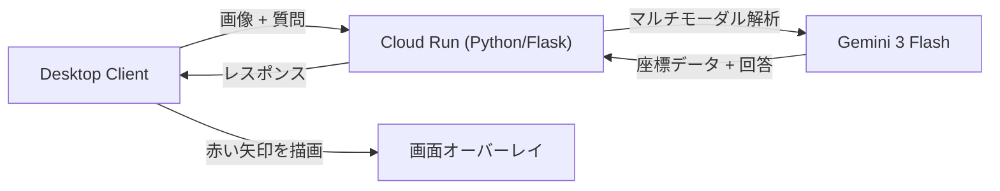

# SENP_AI (センパイ) - AI操作ガイドアシスタント


**SENP_AI** は、PC操作中に迷子になりがちなユーザーを助けるためのデスクトップアシスタントです。
「ダークモードの設定はどこ？」といった質問に対して、言葉で説明するだけでなく、**画面上の該当箇所に赤い矢印を描画して**視覚的に誘導します。

本プロジェクトは **Agentic AI Hackathon with Google Cloud** のために開発されました。

## 🚀 特徴

- **Visual Grounding (座標特定)**: **Gemini 3 Flash** のマルチモーダル機能を使用し、質問の答えとなるボタンやメニューの位置を特定。画面上にオーバーレイで矢印を表示します。
- **高速レスポンス**: 最新の Gemini 3 Flash モデルと **Google Cloud Run** を採用し、ストレスのないリアルタイムな応答を実現。
- **自動スクロール解析**: Webページなど、一画面に収まらない長いコンテンツも自動でスクロールして解析します。
- **音声対話**: キーボード入力不要。マイクボタン一つで質問し、音声で回答を受け取れます。

## 🛠 システム構成



## 📦 インストールと使い方

### 必要要件

- Python 3.9以上
- Google Cloud Project (バックエンド用) または Gemini API Key (ローカル実行用)

### セットアップ

1. **リポジトリのクローン**

    ```bash
    git clone https://github.com/yourusername/SENP_AI.git
    cd SENP_AI
    ```

2. **依存パッケージのインストール**

    ```bash
    pip install -r requirements.txt
    ```

### アプリケーションの実行

**方法A: クラウドバックエンドモード (推奨)**
Cloud Run にバックエンドがデプロイされている場合:

```bash
# Windows (PowerShell/CMD)
set SENP_AI_BACKEND_URL=https://your-cloud-run-url.a.run.app
python run.py
```

**方法B: ローカルモード**
ローカルでGemini APIを直接叩く場合:

```bash
# Windows (PowerShell/CMD)
set GOOGLE_API_KEY=your_gemini_api_key
python run.py
```

## 🏗 技術スタック

- **Backend**: Google Cloud Run, Python (Flask), Google GenAI SDK
- **Frontend**: Python (CustomTkinter), PyAutoGUI
- **AI Model**: Gemini 3 Flash (Multimodal)

## 🎥 デモ動画

[](https://www.youtube.com/watch?v=F37ms5bDq2Y)

---

Powered by **Gemini 3 Flash** & **Google Cloud**.
