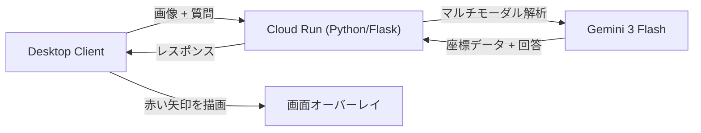

<https://youtu.be/F37ms5bDq2Y>

## はじめに：私の「ワーキングメモリ」を助けてほしい

これは **「Agentic AI Hackathon with Google Cloud」** の参加作品です。

私は、PC操作中に「あれ、今なにを調べていたんだっけ？」と目的を見失うことがよくあります。
いわゆるワーキングメモリ（短期記憶）を保つのが少し苦手で、新しいツールや複雑な設定画面に直面すると、すぐに迷子になってしまいます。

「AIに聞けばいいじゃん」と思われるかもしれませんが、既存のAIには限界がありました。

* **テキストで説明されても分からない**: 「右上の歯車アイコンから...」と言われても、「どれ？？」となってしまう。
* **スクショを貼るのが面倒**: スクショを撮って、AIの画面を開いて、ペーストして...その間に「何を聞こうとしてたっけ？」と忘れてしまう。

私が欲しかったのは、「画面を切り替えず、その場・その瞬間に、画面上に『ここだよ』と矢印を出して教えてくれる」。
そんな、隣の席の優しい先輩のようなAIです。

そこで今回、**「SENP_AI（センパイ）」** というアプリを開発しました。

## ソリューション: SENP_AI

SENP_AI は、ユーザーの画面を常に見守るデスクトップアシスタントです。
ユーザーが「ダークモードの設定はどこ？」「このボタンは何？」と質問すると、**Gemini 3 Flash** のマルチモーダル機能を使って画面を解析。
言葉で長々と説明する代わりに、該当するボタンやメニューの正確な位置を特定し、画面上にオーバーレイで**赤い矢印**を表示して物理的（視覚的）に誘導します。

## 技術的な仕組みと機能

私はプログラミングの専門家ではありませんが、Google Cloud の力を借りることで、自分専用のAIシステムを構築できました。

### システム構成

仕組みはシンプルです。

1. **Client (PC)**: 手元のアプリが画面のスクリーンショットを撮影し、質問と共にクラウドへ送信。
2. **Server (Cloud Run)**: Python (Flask) で作られたバックエンドがリクエストを受信。
3. **AI (Gemini 3 Flash)**: 最新モデルが画像を解析し、「ユーザーが押すべき場所」の座標 (Bounding Box) を特定。
4. **Feedback**: クライアントが座標を受け取り、画面上に「赤い矢印」を描画。

### 主な機能とこだわり

#### 1. Visual Grounding (座標特定)

Gemini API に独自のプロンプトを与え、ターゲット要素の座標を出力させています。
単にテキストで返すだけでなく、`[TARGET_BOX: y_min, x_min, y_max, x_max]` という形式で座標を受け取り、Python (Tkinter) で実際の画面上に矢印を描画します。これにより、「言葉」を読むコストをゼロにしました。

#### 2. 高速レスポンス (Gemini 3 Flash)

ユーザーを待たせないために、最新の **Gemini 3 Flash** モデルを採用しました。
以前のモデルに比べ、画像認識と推論の速度が格段に向上しており、ストレスのないリアルタイムなガイドを実現しています。また、Cloud Run 上のサーバーレス構成により、必要な時だけ起動してコストを抑えています。

#### 3. 自動スクロール解析

Webページなど、一画面に収まらない長いコンテンツの場合でも大丈夫です。
「ページ全体を見て」と指示すると、Pythonスクリプトが自動でスクロールしながら複数枚のスクリーンショットを撮影。それらを統合して Gemini に渡し、ページ全体の構造を理解させます。

#### 4. 音声対話 (Voice Interaction)

キーボード入力すら面倒な時、マイクボタン一つで質問可能です。回答も音声合成 (TTS) で読み上げられるため、ハンズフリーに近い感覚で操作ガイドを受けられます。

## 開発の裏話：AIと二人三脚

正直に言うと、私はPythonのコードをバリバリ書けるわけではありません。今回の開発は、ほとんどAIとのペアプログラミングでした。

特に苦労したのは以下の点です。

* **「SDKが変わっていた」問題**:
    GoogleのAIを使うためのツール（SDK）が `google-genai` に新しくなっていたらしく、ネット上の古い記事の通りに書いても動かず絶望しました。エラーが出るたびにAIにログを見せて、「どう直せばいい？」と聞きながら修正しました。

* **「矢印がズレる」問題**:
    AIが教えてくれる座標と、私のPC画面の座標が微妙にズレてしまい、矢印が何もないところを指してしまうことがありました。これも「座標変換」という計算式をAIに書いてもらうことで何とか解決しました。

まさに、このアプリの名前通り「AI先輩（SENP_AI）」に助けられながら完成したアプリです。

## おわりに

「技術力がないと、自分だけのツールは作れない」と思っていましたが、それは間違いでした。
最新の **Gemini 3 Flash** と **Google Cloud Run**、そして開発を助けてくれるAIがいれば、私のような「困りごと」を抱えた当事者こそが、自分を救うための最強のツールを作れる時代になったのだと感じます。

もし私と同じように「PC操作ですぐ迷子になる」という方がいたら、ぜひこの「SENP_AI」を使ってほしいです。

---

*This project was built for the Agentic AI Hackathon with Google Cloud.*
